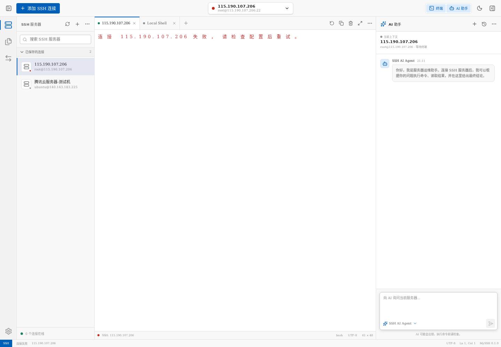

# MySSH

MySSH 是一款面向日常运维场景的 Web SSH 管理工具，提供 SSH 连接管理、终端会话和 AI 运维助手等能力。

## 在线体验

服务地址：**请联系我**

> 当前为公开演示服务，请勿在演示环境中保存生产服务器密码、私钥或其他敏感信息。

## 页面展示

## 功能概览

- SSH 连接管理：集中创建、编辑和管理服务器连接。
- 多会话终端：通过标签页在多个 SSH 会话之间快速切换。
- AI 运维助手：结合当前 SSH 会话分析问题并辅助执行运维任务。
- 连接状态展示：直观显示服务器与终端会话的连接状态。
- Web 化访问：无需安装客户端，通过浏览器即可使用。

## 使用提示

1. 点击左上角“添加 SSH 连接”。
2. 填写服务器地址、端口、用户名及认证信息。
3. 选择已保存的服务器并建立连接。
4. 在中间终端区域进行操作，或使用右侧 AI 助手协助处理运维任务。

## 安全说明

- 请仅连接你有权管理的服务器。
- 公共演示服务不适合存储生产环境凭据。
- 正式使用时建议启用 HTTPS、访问控制并定期轮换密钥。

---

MySSH · SSH 管理与 AI 智能运维
